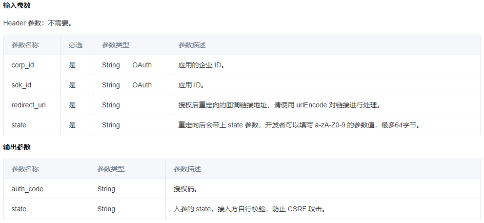
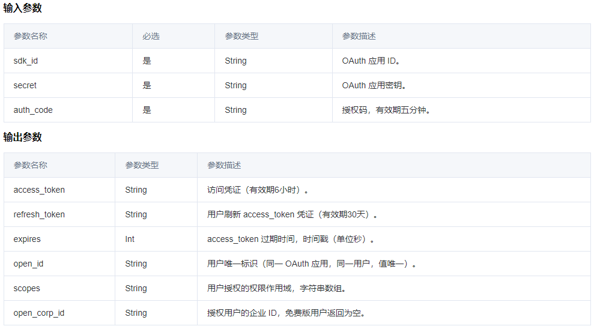
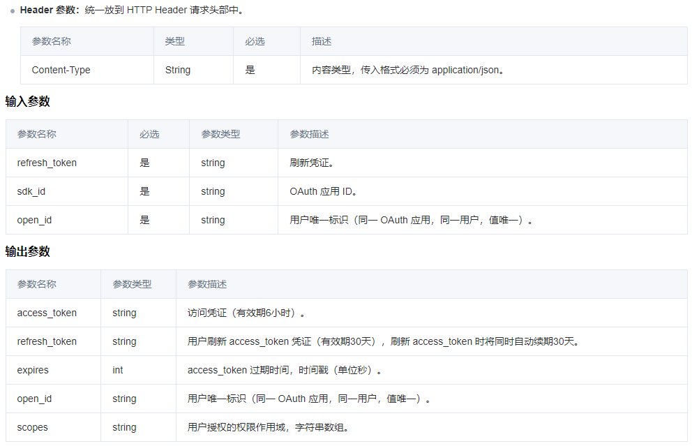
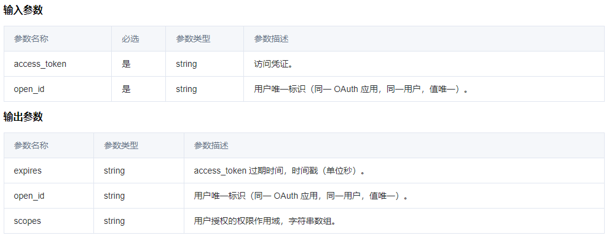

# meeting
https://blog.csdn.net/pityKate/article/details/123823161


### 第三方应用鉴权（OAuth2.0）

https://cloud.tencent.com/document/product/1095/51257

#### 步骤一：用户同意授权，获取 auth_code
场景1：在浏览器中使用第三方应用，可通过此方法打开用户授权新页面，获取 auth_code

请求方式：GET

接口请求域名：https://meeting.tencent.com/marketplace/authorize.html?corp_id=230961742&sdk_id=26140159221&redirect_uri=https://www.zqrb.cn&state=123



场景2：在腾讯会议客户端和 App 内，可通过 JS-API，在当前页面唤起用户授权弹框，获取 auth_code

```javascript
permission.authorize({
  success: ({ authCode }) => { console.log(authCode) },
  // bizCode: 授权业务场景状态码，主要场景有以下几类：
  // 授权成功【0】：AuthorizeBizCode.SUCCEEDED
  // 申请授权成功【1】：AuthorizeBizCode.APPLY_SUCCEED 
  // 用户选择关闭授权弹框【2】 AuthorizeBizCode.CLOSED
  // 用户选择拒绝授权【3】 AuthorizeBizCode.REJECTED
  // 其他异常【4】，请根据bizMessage获知原因 AuthorizeBizCode.UN_KNOW
  fail: ({ bizCode, bizMessage }) => { 
     console.log(bizCode, bizMessage)
  },
}).catch(err => {
   console.error('authorize error', err);
 });
```

#### 步骤二：通过 auth_code 换取授权 access_token
请求方式：POST

接口请求域名：https://meeting.tencent.com/wemeet-webapi/v2/oauth2/oauth/access_token



access_token 访问凭证（有效期6小时）。

refresh_token 用户刷新 access_token 凭证（有效期30天）。

expires access_token 过期时间，时间戳（单位秒）。

open_id 用户唯一标识（同一 OAuth 应用，同一用户，值唯一）。

代码样例:
```php
$access_token = $this->getAccessToken($auth_code);
if (empty($access_token)) { return false; }
```

#### 步骤三：刷新 access_token（如有需要）
接口描述：通过 refresh_token，令牌续约。

请求方式：POST

接口请求域名：https://meeting.tencent.com/wemeet-webapi/v2/oauth2/oauth/refresh_token

> 注意：
不能频繁调用接口刷新 access_token，会受到频率拦截，可以缓存 acces_token 用于后续接口调用，若 access_token 失效或过期时再重新获取。

代码逻辑为:
```php
if (empty($access_token) || $access_token['expires'] < time()) { 
    $access_token = $this->refreshToken($refresh_token); 
}
...
```


#### 步骤四：拉取用户信息（检验凭证是否有效）
接口描述：拉取用户信息（检验凭证是否有效）。

请求方式：POST

请求域名：https://meeting.tencent.com/wemeet-webapi/v2/oauth2/oauth/user_info



鉴权错误返回统一为400。

